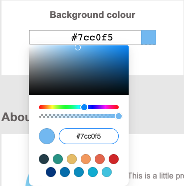
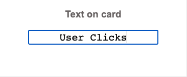
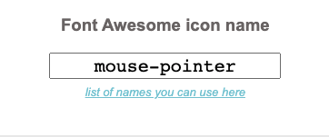
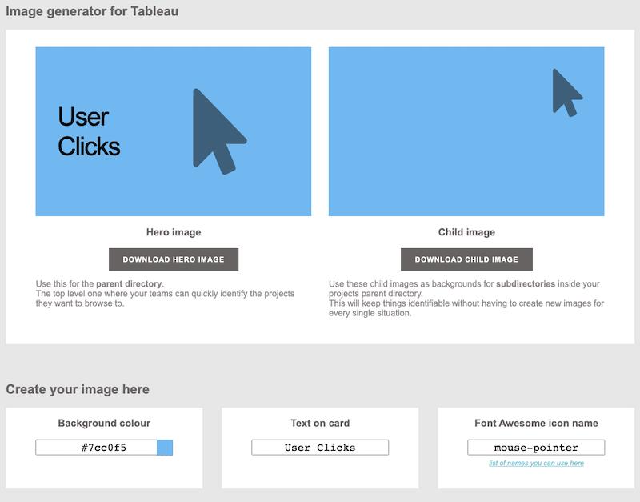

# Tableau thumbnail image generator

A simple web-based image generator to create consistent looking thumbs for tableau.


-------------

<div style="max-width: 800px;">
<h2>How to use</h2>

<div style="display: flex; margin: 20px 0; "> 
<div></div>
<div style="margin: 0 20px; flex: 3;">
<h3>Background Colour</h3>
<p>
Select the Background Colour by clicking on the first swatch. You can select either a recommended swatch or use the colour picker.
</p>
</div>
</div>

<div style="display: flex; margin: 20px 0; "> 
<div></div>
<div style="margin: 0 20px; flex: 3;">
<h3>Text for the Project Thumbnail</h3>
<p>
Select the Text which will be on the image middle swatch "Text on card". Try to keep your labels to 1-3 words if possible.
</p>
</div>

</div>

<div style="display: flex; margin: 20px 0; "> 
<div></div>
<div style="margin: 0 20px; flex: 3;">
<h3>Font Awesome icon name</h3>
<p>
Type the name of the Font Awesome icon you'd like to use. To get the name of the icon you want to use, click the link under the input and copy paste the name into the input box. <br/>
<a href="https://fontawesome.com/v5.15/icons?d=gallery&p=2&q=arr&m=free">link to the Font Awesome icons</a>
</p>
</div>
</div>

<div style="display: flex; flex-direction: column; margin: 20px 0; justify-content: center;"> 
<h3>The output</h3>
<p>
Once all items have been selected, you'll notice that the images have been updated to show your selections. 
To download the content as images, just click the 'download hero image' or 'download child image' button. This will download a png you can embed.
</p>

</div>

<!-- end of 800px container -->
</div>


## Using with Tableau

To embed these images into a tableau project, host the image on an accessible location (like s3) and adding the following to your tableau 'About' section within the 'Project Details' on the LAST LINE

```
!https://<my_url>/<my_image>.png!
```
<a href = "https://help.tableau.com/current/server/en-us/custom_projectimage.htm">More details via Tableau.com</a>


## How it works

we have a little html5 page which loads a bunch of javascript libraries to allow us to work on the canvass. 
- User Enters the Text in an editable form area
- User selects a fontAwesome icon from the dropdown 
- User selects a colour from the swatch / hue shifts existing colours


## libraries / ref

Font Awesome
https://fontawesome.com/v5.15/icons?d=gallery&p=2&m=free

Font Awesome picker
https://codepen.io/thanhansoft/pen/QWjXoNM

Saving Div as image:
https://html2canvas.hertzen.com/